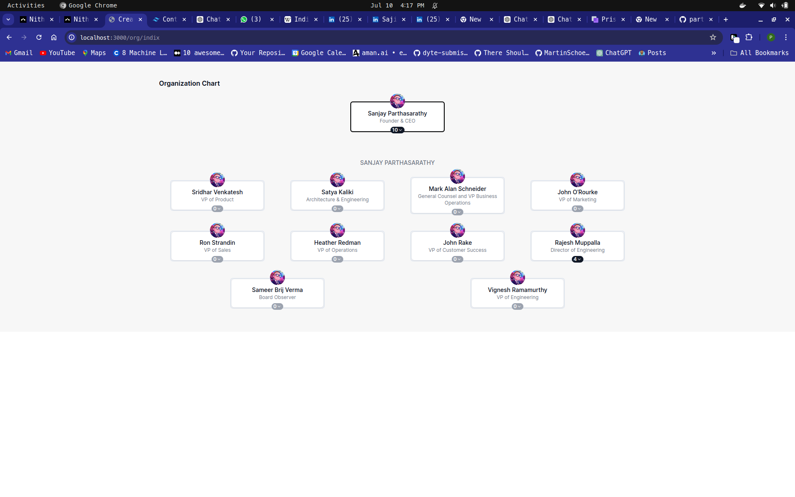
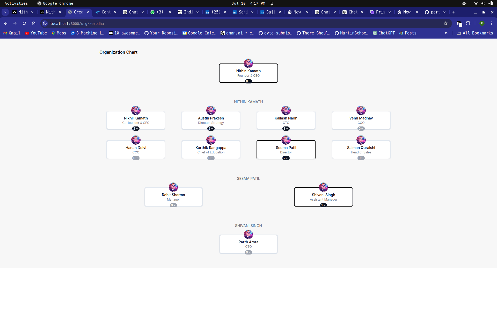
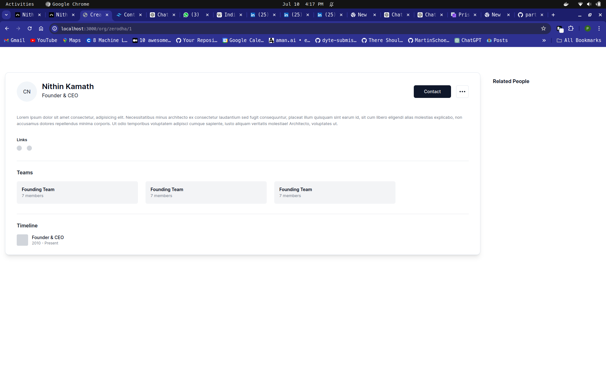

# Organization Tree Project

This project is built using [Next.js](https://nextjs.org/) and Prisma as ORM.It provides a user interface to display and manage an organizational tree, where each node represents an entity in the organization.

## Features

- Display an organizational tree structure.
- Fetch organization data from a backend service.
- Interactive UI to navigate through different nodes of the organization.

## Getting Started

These instructions will help you set up the project locally.

### Installation

1. **Clone the repository:**

   ```bash
   git clone https://github.com/partharora1610/org-tree.git
   ```

2. **Install dependencies:**

   Using npm:

   ```bash
   npm install
   ```

3. **Configure the database:**

   Ensure you have a database set up and configure your database connection in the `prisma/.env` file.

4. **Generate Prisma client:**

   ```bash
   npx prisma generate
   ```

5. **Migrate the Database:**

   ```bash
   npx prisma migrate
   ```

6. **Seeding the Database:**

   ```bash
   npx prisma db seed
   ```

### Running the Next Project

1. **Start the Next.js development server:**

   Using npm:

   ```bash
   npm run dev
   ```

   This will start the Next.js server on `http://localhost:3000`.

## Key Files

- **/backend/prisma/schema.prisma**: Prisma schema file for database structure.
- **/pages/index.tsx**: Main page rendering the organizational tree.

## UI Snaphots






